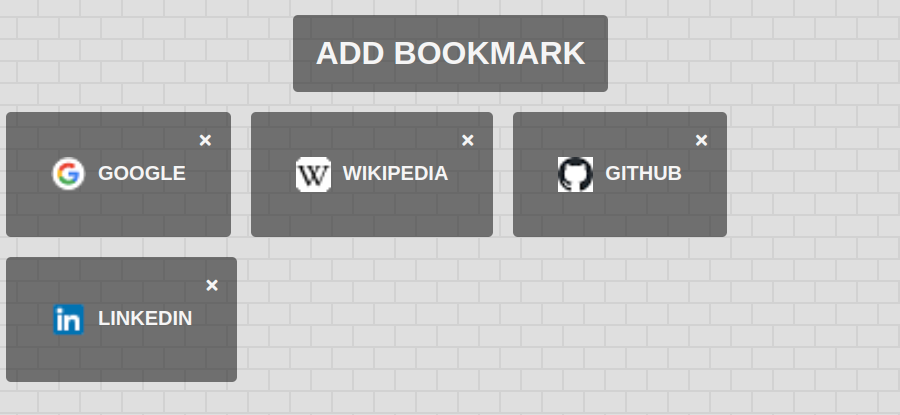

# basicJS_Bookmark Keeper: [LIVE DEMO](https://shcoobz.github.io/basicJS_bookmark-keeper/)

## Summary

Book(mark) Keeper provides a simple and intuitive way to manage your web bookmarks. It features a user-friendly interface, enabling users to easily add, delete, and access their favorite websites.

The core functionality includes:

- **Adding bookmarks**: Users can save their favorite websites along with a title for easy access.
- **Validating URLs**: Ensures that bookmarks are valid URLs before saving.
- **Organizing bookmarks**: Displays saved bookmarks in a structured and visually appealing way.
- **Easy access**: One-click navigation to your saved websites.
- **Deletion of bookmarks**: Allows users to remove bookmarks they no longer need.

## Features

### Adding Bookmarks

Users can add bookmarks by entering the website's name and URL. The application ensures that the information is valid before saving it to the local storage for persistent access.

### URL Validation

This feature checks the format of the URL to ensure it's valid, improving data quality and user experience by preventing errors.

### Dynamic Bookmark Display

Bookmarks are dynamically displayed on the page, with each entry featuring a favicon, the site's name, and a link for quick access. Users can also delete any bookmark.

### Local Storage

Bookmarks are stored in the browser's local storage, making them persist between sessions without the need for an external database or backend.

## Technologies

- **HTML**: Structure of the bookmarking application.
- **CSS**: Styling for the user interface, making it visually appealing.
- **JavaScript**: Powers the application's logic, handling bookmark addition, validation, and dynamic UI updates.
- **Font Awesome**: Provides icons for a more intuitive interface.

---

_Note: This document provides an overview of **Book(mark) Keeper**. For detailed instructions and more information, please refer to the source code documentation._

This project has been enhanced and converted into a React-based application, which can be viewed [here](https://github.com/Shcoobz/react_bookmark-keeper/). The React version integrates more advanced state management and component-based architecture for improved maintainability and scalability.
